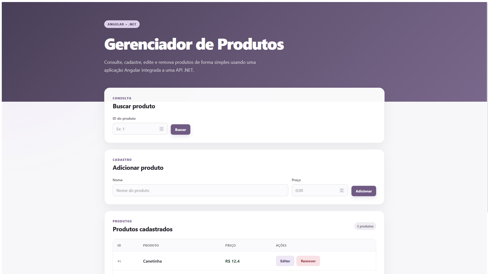

# Gerenciador de Produtos

Aplicação web para gerenciamento de produtos desenvolvida com **Angular** e integrada a uma **API REST em ASP.NET Core**.

O projeto permite realizar as principais operações de CRUD de produtos por meio de uma interface responsiva e amigável.

## Interface



## Funcionalidades

- Listagem de produtos cadastrados
- Busca de produto por ID
- Cadastro de novos produtos
- Edição de produtos diretamente na tabela
- Remoção de produtos
- Validação de campos
- Mensagens de erro e sucesso
- Atualização automática da listagem após alterações
- Integração com API REST desenvolvida em .NET
- Interface responsiva

## Tecnologias utilizadas

### Front-end

- Angular
- TypeScript
- HTML
- CSS
- Angular HttpClient
- Angular Signals
- RxJS

### Back-end

A aplicação consome uma API desenvolvida com:

- ASP.NET Core
- Entity Framework Core
- SQLite
- Swagger / OpenAPI

O repositório do back-end está disponível em:

[product-management-api](https://github.com/juliana-matias-it/product-management-api)

## Arquitetura

O front-end se comunica com a API através de requisições HTTP.

```text
Angular
   │
   │ HTTP
   ▼
ASP.NET Core API
   │
   ▼
Entity Framework Core
   │
   ▼
SQLite
```

O serviço de produtos do Angular concentra a comunicação com os endpoints da API.

## Operações disponíveis

| Operação | Método HTTP | Endpoint |
|---|---|---|
| Listar produtos | GET | `/api/Produtos` |
| Buscar produto por ID | GET | `/api/Produtos/{id}` |
| Criar produto | POST | `/api/Produtos` |
| Atualizar produto | PUT | `/api/Produtos/{id}` |
| Remover produto | DELETE | `/api/Produtos/{id}` |

## Interface

A aplicação possui três áreas principais:

### Buscar produto

Permite consultar um produto específico através do seu ID.

### Adicionar produto

Permite cadastrar um novo produto informando nome e preço.

### Produtos cadastrados

Exibe os produtos em uma tabela e disponibiliza as ações de edição e remoção.

## Executando o projeto

### Pré-requisitos

Antes de começar, é necessário ter instalado:

- Node.js
- npm
- Angular CLI
- .NET SDK para executar a API

### 1. Clone o repositório

```bash
git clone https://github.com/juliana-matias-it/product-management-frontend.git
```

### 2. Entre na pasta do projeto

```bash
cd product-management-frontend
```

### 3. Instale as dependências

```bash
npm install
```

### 4. Inicie a API

O back-end deve estar em execução antes de iniciar o front-end.

Repositório:

```text
https://github.com/juliana-matias-it/product-management-api
```

### 5. Execute o Angular

```bash
ng serve
```

A aplicação ficará disponível em:

```text
http://localhost:4200
```

## Configuração da API

Atualmente o endereço utilizado pelo front-end está configurado no serviço de produtos:

```typescript
private apiUrl = 'http://localhost:5220/api/Produtos';
```

Caso a API seja executada em outra porta, esse endereço deve ser atualizado.

## Testes

Para executar os testes:

```bash
ng test
```

## Build

Para gerar uma build do projeto:

```bash
ng build
```

## Sobre o projeto

Este projeto foi desenvolvido como parte de um exercício prático de integração entre **Angular e ASP.NET Core**, com o objetivo de aplicar conceitos de desenvolvimento front-end, consumo de APIs REST e operações CRUD.

Além dos requisitos funcionais do exercício, a interface foi aprimorada com foco em organização, responsividade e experiência do usuário.

## Autora

**Juliana Matias**

GitHub: [juliana-matias-it](https://github.com/juliana-matias-it)